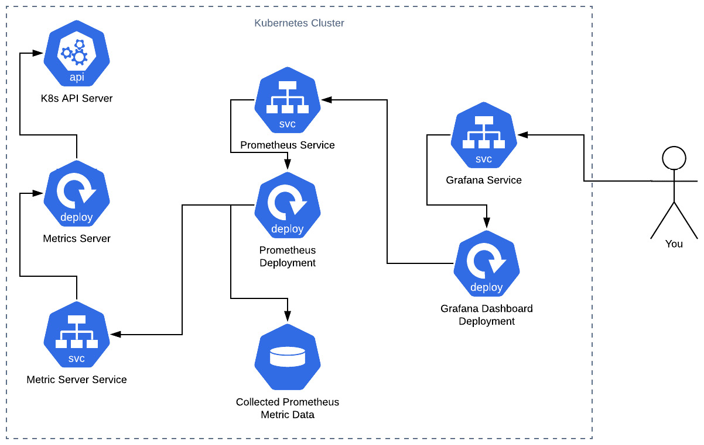

# Hands on monitoring

## Metric server

Metric Server es un servidor para exponer métricas sobre componentes de Kubernetes.



## Commands

### Prometheus

I. Search repo

```
helm search repo prometheus-community
```

II. Add repository

```
helm repo add prometheus-community https://prometheus-community.github.io/helm-charts
```

III. Download chart and unpack

```
helm pull prometheus-community/kube-prometheus-stack --untar
```

IV. Create namespace

```
kubectl create ns monitoring
```

V. Install chart

```
helm install kube-prometheus-stack ./kube-prometheus-stack -n monitoring
```

VI. Check install

```
helm list -n monitoring
```

### Grafana

```
helm repo add grafana https://grafana.github.io/helm-charts
helm pull bitnami/grafana --untar
helm install grafana ./grafana -n monitoring
helm list -n monitoring
kubectl get secret grafana-admin --namespace monitoring  -o jsonpath="{.data.GF_SECURITY_ADMIN_PASSWORD}" | base64 -d
kubectl port-forward svc/grafana 3000:3000 -n monitoring
```